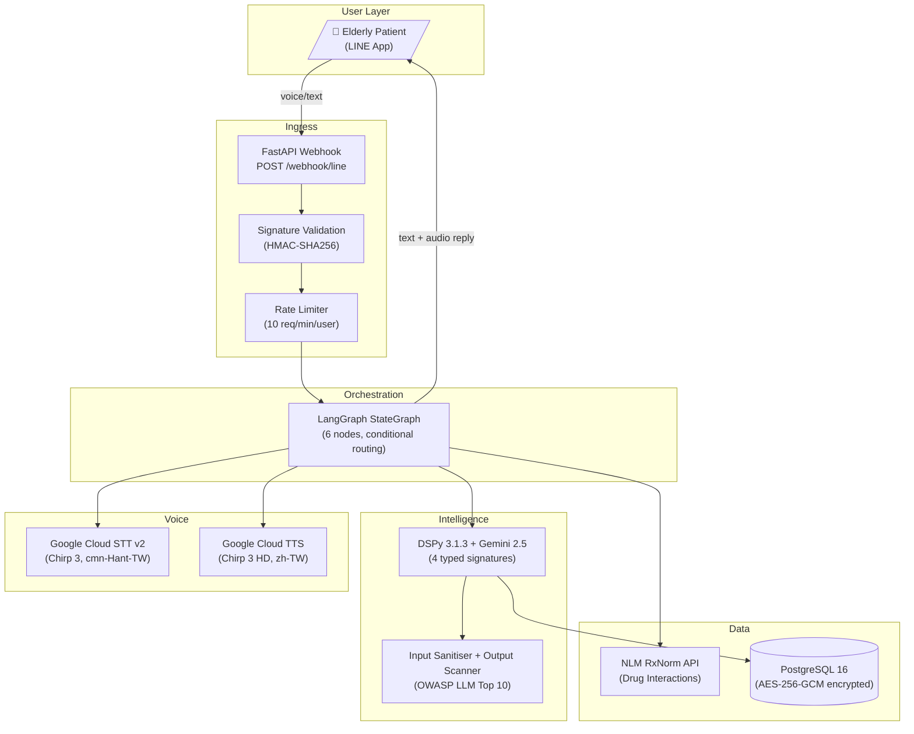
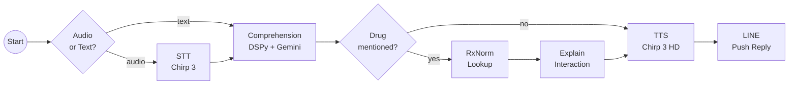
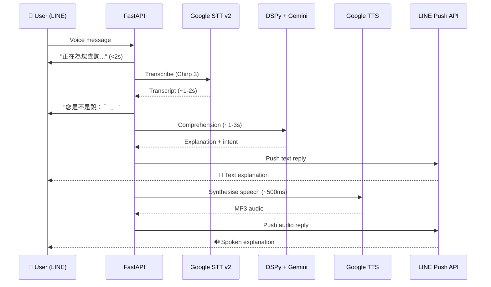
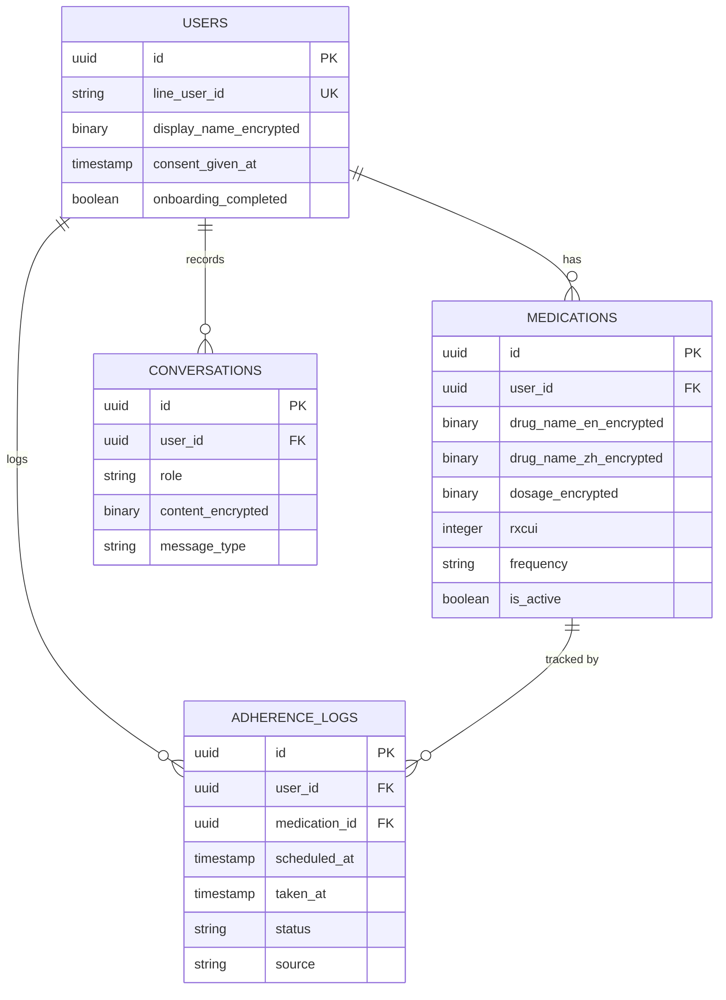

# MedBuddy

**AI-powered medication assistant for elderly users — voice-first, LINE-native, Mandarin-capable.**

MedBuddy helps elderly patients in Taiwan understand their medications through natural voice conversations on LINE. It treats medication adherence as a *comprehension problem*, not a reminder problem.

> "醫生開了一個叫 Metformin 的藥給我，這是做什麼用的？"
> *(Doctor prescribed something called Metformin — what's it for?)*

MedBuddy responds with a warm, spoken + text explanation in plain 繁體中文, checks drug interactions against authoritative medical databases, and tracks daily adherence — all through the messaging app 94% of Taiwan already uses.

---

## Live Demo

> **Demo videos:** [`docs/demo/`](docs/demo/) — recorded live on LINE with the prototype running locally via cloudflared tunnel.

### Voice Input → Mandarin Comprehension
[`voice_poc.mp4`](docs/demo/voice_poc.mp4) — User sends a voice message in Mandarin asking about a medication. MedBuddy transcribes via Gemini multimodal STT, generates a warm explanation via DSPy + Gemini, and replies with both text and spoken audio (edge-tts).

### Text Input → Medication Explanation
[`text_poc.mp4`](docs/demo/text_poc.mp4) — User types "Metformin 是什麼藥？" — MedBuddy explains the drug's purpose, timing, and key warnings in plain 繁體中文 at a primary-school reading level, then defers to the user's doctor.

---

## Architecture



## Pipeline Flow



## Voice Pipeline — Latency Budget



**The Two-Message Pattern:** Text reply arrives in ~3-5s. Audio arrives in ~5-8s. The user never waits — they see text immediately, then hear audio as a bonus.

## Tech Stack

| Layer | Technology | Why |
|---|---|---|
| **Framework** | FastAPI (async) | Native async, Pydantic validation, BackgroundTasks |
| **LLM** | Gemini 2.5 via DSPy 3.1.3 | Typed signatures, ChainOfThought reasoning, model-swappable |
| **Orchestration** | LangGraph StateGraph | Thread-per-user memory, conditional routing, checkpointing |
| **STT** | Google Cloud STT v2 (Chirp 3) | Production API, native async, `cmn-Hant-TW` support |
| **TTS** | Google Cloud TTS (Chirp 3 HD) | Warm zh-TW voice, SSML pacing for elderly users |
| **Drug Data** | NLM RxNorm API | Authoritative interaction data (free, NIH-backed) |
| **Database** | PostgreSQL 16 + SQLAlchemy 2.x async | AES-256-GCM field-level encryption |
| **Messaging** | LINE Messaging API | 94% penetration in Taiwan, voice messages native |
| **Scheduling** | APScheduler | Daily medication check-in push messages |
| **Security** | OWASP LLM Top 10 compliant | Input sanitiser (12 injection patterns), output scanner |

## DSPy Signatures

Four typed signatures with ChainOfThought reasoning:

| Signature | Purpose | LM |
|---|---|---|
| `MedicationExplanation` | Explain drugs in plain 繁體中文 (primary-school reading level) | Gemini 2.5 Pro |
| `InteractionExplanation` | Translate RxNorm interaction data to plain language | Gemini 2.5 Flash |
| `AdherenceCheckIn` | Parse daily check-in responses (taken/missed/follow-up) | Gemini 2.5 Flash |
| `ConversationResponse` | General conversation with intent detection | Gemini 2.5 Flash |

## Compliance & Safety

| Area | Implementation |
|---|---|
| **PDPA (Taiwan)** | Explicit consent on first interaction, data deletion via "刪除我的資料" command |
| **Encryption** | AES-256-GCM field-level encryption for all health data (drug names, dosages, conversations) |
| **OWASP LLM01** | Input sanitiser: 12 prompt injection patterns detected and stripped |
| **OWASP LLM02** | Output scanner: XSS, script tags, HTML stripped before LINE delivery |
| **Rate Limiting** | Per-user sliding window (10 AI requests/minute) |
| **Medical Safety** | Never gives medical advice, never recommends catching up missed doses, always defers to doctor |
| **PII Logging** | Only `line_user_id` in logs — never display names or medication details |

## Quick Start

### Prerequisites

- Python 3.13+
- [uv](https://docs.astral.sh/uv/) (package manager)
- Docker (for PostgreSQL)
- ffmpeg (`brew install ffmpeg`)
- Google Cloud account with Speech-to-Text + Text-to-Speech APIs enabled
- LINE Messaging API channel

### Setup

```bash
# Clone
git clone https://github.com/impravin22/medbuddy.git
cd medbuddy

# Install dependencies
uv sync --all-extras

# Configure environment
cp .env.example .env
# Edit .env with your API keys

# Start PostgreSQL
docker compose up -d

# Run migrations
uv run alembic upgrade head

# Start the server
uv run uvicorn app.main:app --reload --port 8000

# Expose for LINE webhook (in another terminal)
ngrok http 8000
```

Set the ngrok URL as your LINE webhook URL in the [LINE Developer Console](https://developers.line.biz/).

### Environment Variables

| Variable | Description |
|---|---|
| `GOOGLE_API_KEY` | Gemini API key |
| `GOOGLE_AI_DEFAULT_MODEL` | Default LLM model (default: `gemini-2.5-pro`) |
| `GOOGLE_AI_FAST_MODEL` | Fast LLM model (default: `gemini-2.5-flash`) |
| `LINE_CHANNEL_SECRET` | LINE Developer Console channel secret |
| `LINE_CHANNEL_ACCESS_TOKEN` | LINE Developer Console channel access token |
| `DATABASE_URL` | PostgreSQL connection string |
| `GOOGLE_CLOUD_PROJECT` | GCP project ID (for STT + TTS) |
| `GOOGLE_APPLICATION_CREDENTIALS` | Path to GCP service account JSON |
| `AES_ENCRYPTION_KEY` | 64 hex chars for AES-256 (generate: `python -c "import os; print(os.urandom(32).hex())"`) |

## Testing

```bash
# Run all tests (99 tests)
uv run pytest tests/ -v

# Run specific test file
uv run pytest tests/test_encryption.py -v

# Lint
uv run ruff check .

# Format check
uv run ruff format --check .
```

| Test File | Tests | Covers |
|---|---|---|
| `test_encryption.py` | 13 | AES-256-GCM round-trip, tamper detection, key validation |
| `test_dspy_service.py` | 10 | DSPy signatures, LM routing, async calls |
| `test_sanitiser.py` | 31 | 12 injection patterns, shell chars, XSS, output scanning |
| `test_pipeline.py` | 17 | LangGraph nodes, conditional routing, graph structure |
| `test_line_service.py` | 8 | Webhook signature validation, event parsing |
| `test_voice_service.py` | 5 | STT transcription, TTS synthesis, audio conversion |
| `test_compliance.py` | 15 | Rate limiting, consent, data deletion, medical safety |

## Project Structure

```
medbuddy/
├── app/
│   ├── main.py                    # FastAPI app + LINE webhook
│   ├── config.py                  # pydantic-settings configuration
│   ├── database.py                # SQLAlchemy async engine
│   ├── scheduler.py               # APScheduler daily check-in
│   ├── models/
│   │   ├── user.py                # User with encrypted display name
│   │   ├── medication.py          # Medications with AES-256 fields
│   │   ├── adherence.py           # Adherence logs (taken/missed/skipped)
│   │   └── conversation.py        # Encrypted conversation history
│   ├── handlers/
│   │   ├── message_handler.py     # Route LINE events → pipeline
│   │   ├── onboarding_handler.py  # PDPA consent + data deletion
│   │   └── checkin_handler.py     # Adherence logging to DB
│   └── services/
│       ├── dspy_service.py        # 4 DSPy signatures + LM singletons
│       ├── pipeline.py            # LangGraph StateGraph (6 nodes)
│       ├── voice_service.py       # Google Cloud STT v2 + TTS
│       ├── line_service.py        # LINE API helpers
│       ├── drug_service.py        # NLM RxNorm API client
│       ├── encryption.py          # AES-256-GCM encrypt/decrypt
│       ├── sanitiser.py           # OWASP LLM input/output security
│       └── rate_limiter.py        # Per-user sliding window
├── docs/
│   ├── PRD.md                     # Product Requirements Document
│   └── TDD.md                     # Technical Design Document
├── tests/                         # 99 tests, 7 files
├── alembic/                       # Database migrations
├── docker-compose.yml             # PostgreSQL 16
└── pyproject.toml                 # Dependencies + ruff config
```

## Key Design Decisions

| Decision | Chosen | Rejected Alternative | Why |
|---|---|---|---|
| **STT** | Google Cloud STT v2 (Chirp 3) | OpenAI Whisper (57.7% CER on elderly Mandarin) | Production API, no local dependency risk. Whisper is unusable for elderly speakers |
| **LLM wrapper** | DSPy typed signatures | Direct Gemini SDK (no structured output guarantees) | Type safety, ChainOfThought, auto-optimisable prompts |
| **Orchestration** | LangGraph StateGraph | Plain async Python (no checkpointing, no memory) | Thread-per-user conversation memory, conditional routing |
| **Drug data** | RxNorm API (authoritative) | Gemini knowledge (hallucination risk) | Never trust an LLM for drug interaction ground truth |
| **Encryption** | App-layer AES-256-GCM | pgcrypto (DB-dependent, not portable) | Field-level, unit-testable, DB-agnostic |
| **Platform** | LINE (94% Taiwan penetration) | Standalone app (requires install) | Zero friction for elderly users, voice messages native |

## Data Model



## Documents

- **[PRD](docs/PRD.md)** — User, pain point, market wedge, MVP scope, sequencing rationale
- **[TDD](docs/TDD.md)** — Architecture diagrams, design decisions with alternatives/trade-offs, compliance architecture, scalability path

## Licence

Proprietary — AI Fund Builder Challenge submission.
