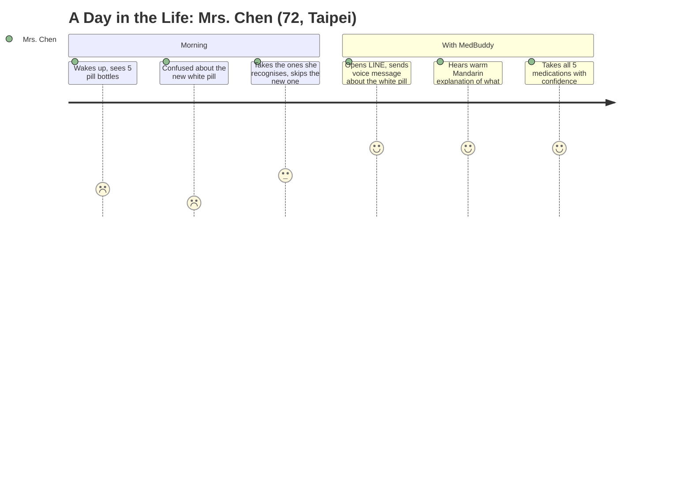
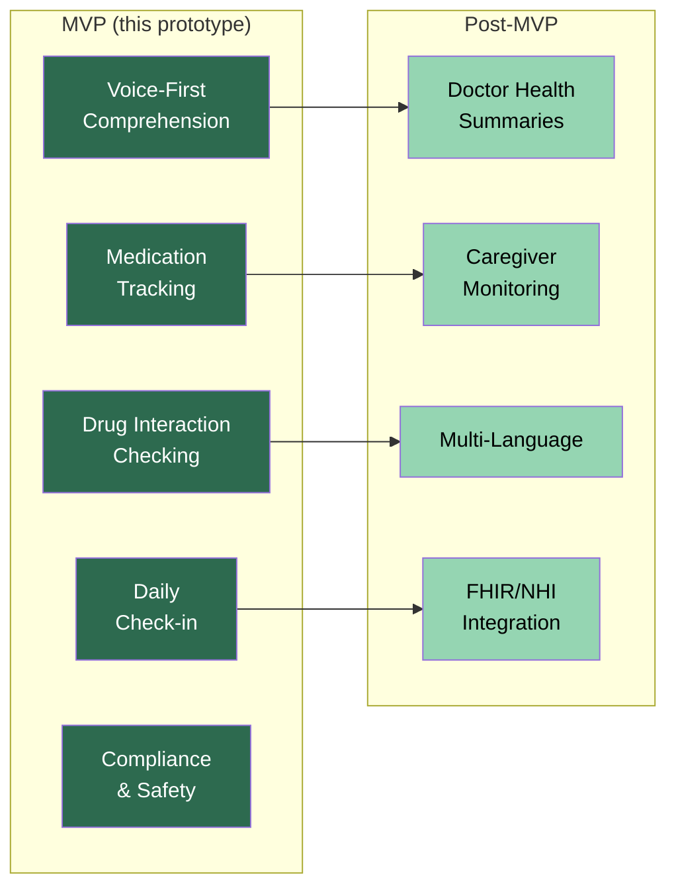

# MedBuddy — Product Requirements Document

## 1. The Problem

Elderly patients with chronic conditions manage 5-8 daily medications, yet adherence rates hover around 50%. The consequence: avoidable hospitalisations, worsening outcomes, and billions in preventable healthcare costs.

**The critical insight:** existing solutions treat this as a *reminder* problem. It is a *comprehension* problem.

A patient who doesn't understand what a pill does, why the timing matters, or what happens if they skip a dose will not adhere — regardless of how many alarms go off. MedBuddy addresses the root cause: **understanding**.

## 2. Primary User

**Profile:** Elderly patient (65+) in Taiwan with 2+ chronic conditions (hypertension, diabetes, hyperlipidaemia), managing 5-8 daily medications prescribed across 2-3 specialists.

**Constraints:**
- Cannot read English drug names on prescription labels
- Cannot type Chinese characters fluently on a smartphone
- Culturally reluctant to "bother" their doctor with questions
- Comfortable sending voice messages on LINE (already does this daily with family)

## 3. Market Wedge

**Why Taiwan first:**

| Factor | Taiwan | Japan | US |
|---|---|---|---|
| Aged 65+ population | 18.4% (fastest-growing in Asia) | 29.3% | 17.3% |
| Dominant messaging platform | LINE (94% penetration) | LINE (86M MAU) | Fragmented (SMS, WhatsApp, iMessage) |
| Healthcare system | Universal NHI, standardised prescriptions | Universal NHI | Fragmented (insurance-dependent) |
| Regulatory complexity | Moderate (PDPA) | High (APPI) | Very high (HIPAA) |
| Language model maturity | Strong (Gemini zh-TW) | Strong | Native |

**Expansion sequence:** Taiwan → Japan (LINE reuse + ageing demographics) → Korea (KakaoTalk) → US (SMS/WhatsApp, HIPAA compliance required)

**Why LINE, not a standalone app:**
- Zero installation friction — 94% of Taiwan already has it
- Voice messages are a native LINE feature elderly users already know
- Rich messaging (text + audio) without building a custom UI
- **Alternative rejected: standalone mobile app** — requires App Store submission, download, account creation. Every step loses elderly users. LINE eliminates all of these.
- **Alternative rejected: web app** — elderly users in Taiwan don't browse the web on their phones. They live in LINE.

## 4. MVP Scope

**In scope:**
1. **Voice-first medication comprehension** — user speaks to LINE in Mandarin, receives warm spoken + text explanation in plain 繁體中文
2. **Medication tracking** — stored in encrypted DB, used as context for all interactions
3. **Drug interaction checking** — authoritative data from NLM RxNorm API, explained in plain language by Gemini
4. **Daily check-in** — scheduled push message asking "今天的藥都吃了嗎？" with adherence logging
5. **Compliance** — PDPA consent, AES-256 encryption, input sanitisation, prompt injection prevention, medical safety guardrails

**Out of scope (post-MVP):** Caregiver dashboard, PDF health summaries, multi-language, LINE Rich Menu / LIFF

## 5. Sequencing Rationale

| Phase | Timeline | Deliverable | Why This Order |
|---|---|---|---|
| 1 | 48 hours | Voice comprehension via LINE | Validates the core thesis — comprehension, not reminders. Hardest technical problem. Strongest differentiator |
| 2 | Weeks 1-4 | Doctor-ready health summaries | Creates two-sided value: patient gets understanding, doctor gets structured data. Unlocks B2B (clinic partnerships) |
| 3 | Weeks 5-8 | Family/caregiver monitoring | Expands user base without acquiring new primary users. Family members drive viral adoption |
| 4 | Weeks 9-12 | Japan market prep | LINE integration is reusable. Japanese language tuning + APPI regulatory review |

## 6. Success Criteria

An evaluator can open LINE, send a voice message in Mandarin asking about a medication, and receive a warm, accurate, spoken + text explanation — **within 10 seconds, with zero app installation.**

## 7. Live Demo

| Demo | Description | Video |
|---|---|---|
| **Voice Input** | User sends Mandarin voice message → Gemini STT transcription → DSPy comprehension → text + audio reply | [voice_poc.mp4](demo/voice_poc.mp4) |
| **Text Input** | User types "Metformin 是什麼藥？" → warm explanation in 繁體中文 → defers to doctor | [text_poc.mp4](demo/text_poc.mp4) |

Both demos recorded live on LINE with the prototype running locally (FastAPI + cloudflared tunnel).
