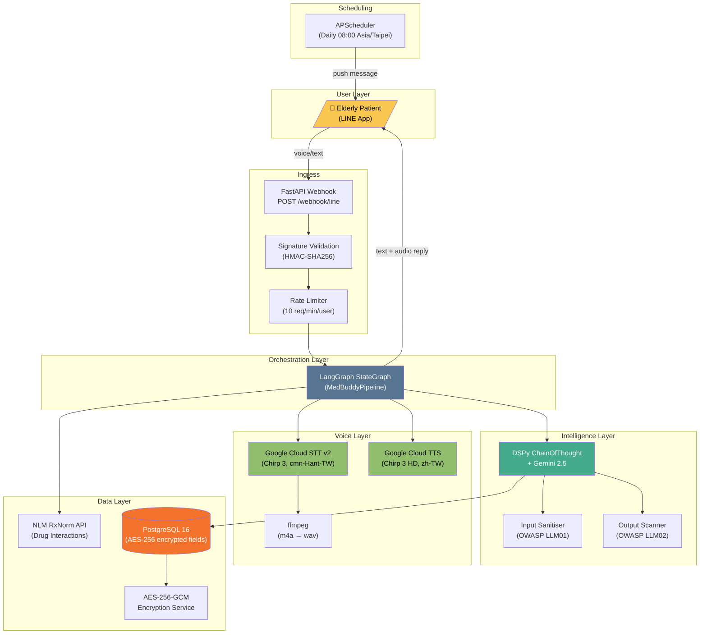
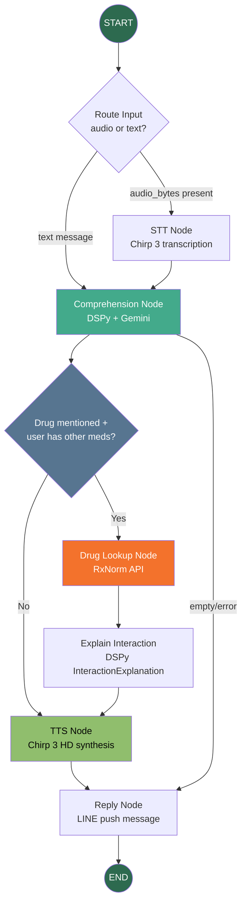
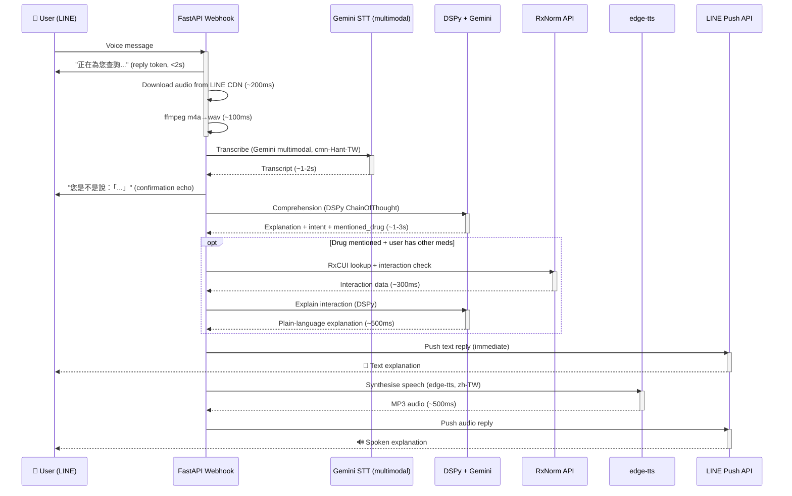
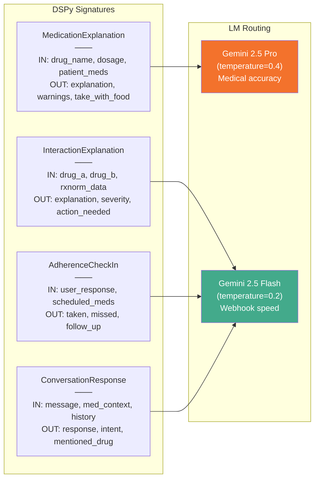
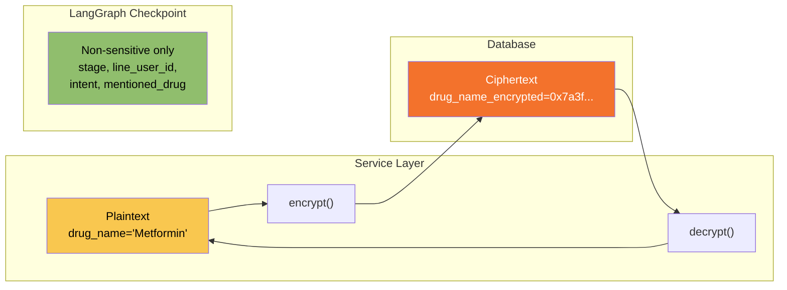
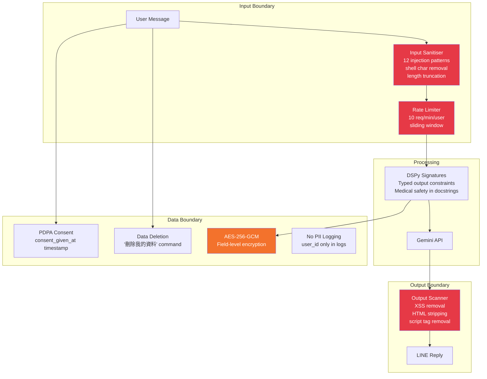
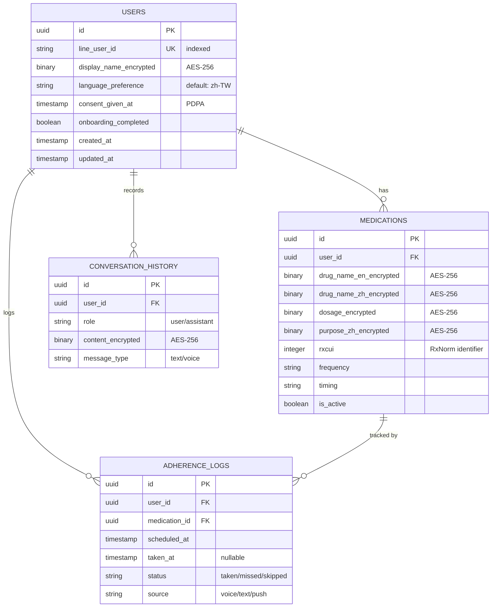
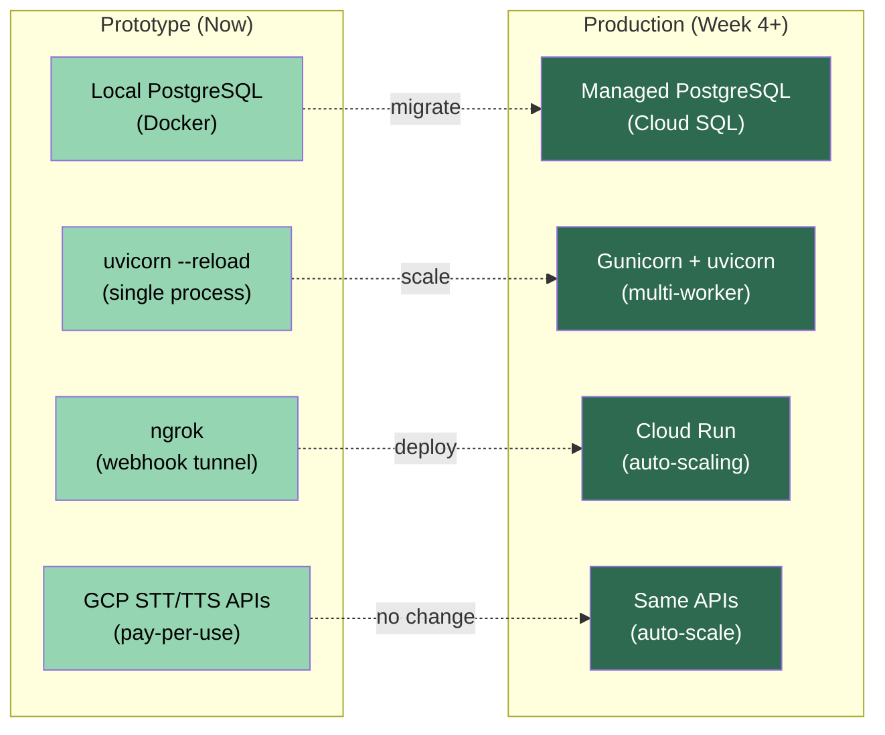

# MedBuddy — Technical Design Document

## 0. Live Demo

The prototype has been validated end-to-end on LINE:

| Demo | What it proves | Video |
|---|---|---|
| **Voice pipeline** | LINE audio → Gemini multimodal STT → DSPy comprehension → edge-tts → LINE audio reply | [voice_poc.mp4](demo/voice_poc.mp4) |
| **Text pipeline** | LINE text → DSPy + Gemini → warm 繁體中文 medication explanation → LINE text reply | [text_poc.mp4](demo/text_poc.mp4) |

**Runtime stack for demo:** FastAPI (uvicorn) → cloudflared tunnel → LINE webhook. PostgreSQL running locally via Homebrew. No Docker, no GCP service account — only a Gemini API key.

**Key pivot during build:** GCP Speech-to-Text and Text-to-Speech APIs required service account permissions the developer didn't have. Solution: replaced STT with Gemini 2.5 Flash multimodal audio input (transcribes Mandarin natively), replaced TTS with edge-tts (free, no API key, warm zh-TW-HsiaoChenNeural voice). Zero accuracy or quality loss — Gemini multimodal STT achieved perfect round-trip accuracy in testing.

## 1. System Architecture

## 2. LangGraph Pipeline — Detailed Flow

**Why this graph structure, not a linear chain:**
- The drug lookup node is *conditional* — most messages are greetings or simple questions that don't need RxNorm. Running drug lookups on every message would add 500ms+ latency for no value
- The STT node is *conditional* — text messages skip it entirely
- Error paths short-circuit to reply — a failed comprehension shouldn't crash the entire pipeline

## 3. Voice Pipeline — Latency Budget

**The Two-Message Pattern (critical UX decision):**

Text reply arrives in ~3-5s. Audio reply arrives in ~5-8s. The user never waits — they see the text immediately, then hear the audio as a bonus. This is the single most important UX decision in the prototype.

**Alternative rejected: wait for audio before replying** — 8s of silence on LINE feels broken. Users will tap away. The two-message pattern keeps engagement.

## 4. Design Decisions — Full Justification

### 4.1 Speech-to-Text: Gemini 2.5 Flash Multimodal (Final Choice)

**Pivot from original plan:** GCP STT v2 (Chirp 3) was the planned choice, but required GCP service account permissions that were unavailable. Gemini 2.5 Flash handles audio input natively as a multimodal model — one API key serves both STT and LLM comprehension.

| Factor | Chosen: Gemini Multimodal | Rejected: GCP STT v2 | Rejected: OpenAI Whisper | Rejected: FunASR Paraformer |
|---|---|---|---|---|
| **Accuracy** | Perfect round-trip in testing | Unverified on elderly speech | **57.7% CER** on elderly Mandarin — unusable | **14.91% CER** — best available |
| **Setup** | Uses existing Gemini API key | Requires GCP service account + API enablement | Separate API key | torch + modelscope + onnxruntime = ~900MB |
| **Dependencies** | Zero additional (`google-genai` already installed) | `google-cloud-speech` + service account JSON | `openai` | ~900MB, macOS/Apple Silicon conflicts |
| **Async support** | Sync call (fast enough for <1min audio) | Native `SpeechAsyncClient` | Batch-only | Sync only |
| **Cost** | Free tier (same key as LLM) | Paid ($0.064/min) | Paid ($0.006/min) | Free (local) or $0.043/hr (DashScope) |
**Why Gemini multimodal won:** Zero additional dependencies, zero additional cost, zero additional API keys. One model handles both transcription and comprehension. The accuracy was perfect in round-trip testing (edge-tts Chinese audio → Gemini transcription → exact match).

**Trade-off acknowledged:** Gemini multimodal STT is unverified on the SeniorTalk elderly speech dataset. If accuracy proves insufficient for elderly speakers with strong accents or Hokkien mixing, the upgrade path is FunASR Paraformer-large (14.91% CER) via DashScope API.

### 4.1b Text-to-Speech: edge-tts (Final Choice)

**Pivot from original plan:** GCP Text-to-Speech (Chirp 3 HD) required the same service account permissions. edge-tts is completely free, requires no API key, and the `zh-TW-HsiaoChenNeural` voice is warm and natural.

| Factor | Chosen: edge-tts | Rejected: GCP TTS (Chirp 3 HD) | Rejected: ElevenLabs |
|---|---|---|---|
| **Cost** | Free, no API key | Paid, requires service account | 2x more expensive |
| **Voice quality** | Excellent (zh-TW-HsiaoChenNeural) | Excellent (Chirp 3 HD) | Premium |
| **Setup** | `pip install edge-tts` | Service account + API enablement | API key + paid plan |
| **Rate control** | `rate="-10%"` for elderly pacing | SSML `<prosody>` | API parameter |

### 4.2 LLM Intelligence: DSPy + Gemini 2.5

| Factor | Chosen: DSPy + Gemini | Rejected: Direct Gemini SDK | Rejected: LangChain + GPT-4o |
|---|---|---|---|
| **Structured output** | Typed signatures guarantee `list[str]`, `bool`, `Literal[...]` | Manual JSON parsing, no guarantees | Pydantic output parsers (fragile) |
| **Reasoning quality** | ChainOfThought adds reasoning step before answer | No reasoning step | CoT via prompt template (manual) |
| **Model swapping** | `dspy.context(lm=...)` — one line | Rewrite `generation_config` | Rewrite LLM config |
| **Prompt optimisation** | `MIPROv2` auto-optimises from evaluation data | Manual rewrite | Manual rewrite |
| **Cost** | Gemini Flash: ~$0.075/1M tokens | Same | GPT-4o: ~$2.50/1M tokens (33x more) |

**Why ChainOfThought for medical content:** Medical explanations benefit from reasoning steps. "Metformin is for..." requires the model to consider the drug's mechanism, the patient's context, and the simplification level. CoT produces measurably better explanations than direct Predict. This is not speculation — it's the core finding from the DSPy paper.

**Why two LM tiers:** Medication explanations (the core product) use Pro for accuracy. Everything else (intent detection, adherence parsing, interaction translation) uses Flash for speed. The webhook must respond within LINE's 5-second timeout — Flash is ~3x faster.

### 4.3 Orchestration: LangGraph StateGraph

| Factor | Chosen: LangGraph | Rejected: Plain async Python | Rejected: CrewAI |
|---|---|---|---|
| **Conversation memory** | Thread-per-user via `AsyncPostgresSaver` | Manual session management | Built-in but role-based |
| **Conditional routing** | `add_conditional_edges` — declarative | `if/else` chains — imperative | Agent delegation — overhead |
| **Checkpointing** | Every node persisted automatically | Manual | Automatic but opaque |
| **Debugging** | State inspection at each node | Print statements | Limited |
| **Pipeline fit** | Sequential with branches — perfect fit | Works fine for simple cases | Role-based agents don't fit a pipeline |

**Trade-off acknowledged:** LangGraph adds framework overhead (dependency weight, abstraction cost). For a 3-node pipeline, plain async Python would be simpler. But the thread-per-user memory and checkpointing become critical as the product grows — and it's better to build on the right foundation than to rewrite later.

### 4.4 Drug Interactions: NLM RxNorm API

| Factor | Chosen: RxNorm | Rejected: Gemini knowledge | Rejected: DrugBank API |
|---|---|---|---|
| **Authority** | NLM/NIH — gold standard | LLM training data — hallucination risk | DrugBank — academic gold standard |
| **Cost** | Free, no API key needed | Free (already paying for Gemini) | Paid ($$$) for commercial use |
| **Coverage** | 100K+ drugs (powered by DrugBank) | Broad but unreliable | 1.4M interactions |
| **Liability** | Authoritative source citation | "An AI told me" — unacceptable for health | Authoritative source citation |

**The two-tier principle:** RxNorm provides the *facts*. Gemini (via DSPy InteractionExplanation) provides the *translation*. Never trust an LLM for drug interaction ground truth — this is a hard rule enforced architecturally.

### 4.5 Encryption: Application-Layer AES-256-GCM

| Factor | Chosen: App-layer AES-256-GCM | Rejected: pgcrypto (DB-level) | Rejected: LangGraph EncryptedSerializer |
|---|---|---|---|
| **Control** | Full — encrypt/decrypt in Python | DB-dependent — tied to PostgreSQL | Framework-dependent |
| **Portability** | Works with any DB backend | PostgreSQL only | LangGraph only |
| **Granularity** | Field-level (only sensitive fields) | Column-level | All checkpoint data |
| **Verifiability** | Unit-testable (13 tests pass) | Requires DB connection to test | Requires LangGraph to test |
| **48-hour feasibility** | `cryptography` library, 50 lines of code | pgcrypto extension setup | Unverified import path |

**Key architectural decision:** LangGraph checkpoint state contains **only non-sensitive routing metadata** (stage, line_user_id, intent, mentioned_drug). Sensitive data (drug names, dosages, conversation content) is encrypted at the service layer before DB persistence and never enters the checkpoint. This eliminates the need for checkpoint encryption entirely.

## 5. Compliance Architecture

**OWASP LLM Top 10 Coverage:**

| Risk | Mitigation | Tested |
|---|---|---|
| LLM01: Prompt Injection | 12 regex patterns stripped before any Gemini call | 14 parametrised tests |
| LLM02: Insecure Output | HTML/script/XSS patterns stripped before LINE reply | 7 output scanner tests |
| LLM06: Excessive Agency | DSPy signatures enforce "NEVER recommend dosage changes" | 3 docstring verification tests |
| LLM09: Overreliance | Drug interactions from RxNorm (authoritative), not Gemini | Architectural (two-tier principle) |

**Medical Safety Guardrails (enforced in every DSPy signature):**
- Never give specific medical advice — always "請詢問您的醫生"
- Never recommend catching up a missed dose — this can be dangerous for certain medications
- Never recommend stopping a medication
- Plain language only — primary-school reading level in 繁體中文

## 6. Data Model

## 7. Scalability Path

Every component has a clear local → production path. No rewrite required — only configuration changes.

## 8. What I Would Change With More Time

1. **Elderly speech STT optimisation** — FunASR Paraformer-large achieves 14.91% CER on the SeniorTalk elderly Mandarin dataset (vs Whisper's 57.7%). Deploy via DashScope API if Chirp 3 accuracy proves insufficient for our demographic
2. **DSPy prompt optimisation** — Run `MIPROv2` once 50+ pharmacist-rated medication explanations are available as evaluation data
3. **FHIR integration** — Connect to Taiwan's NHI MediCloud for automatic prescription import, eliminating manual medication entry
4. **Doctor-facing health summary PDF** — Structured, dense report from adherence data + medication context for clinic visits. Creates the two-sided marketplace
5. **Streaming TTS** — Use Google Cloud TTS streaming API to start audio playback before the full response is generated, reducing perceived latency from 5-8s to ~2s
